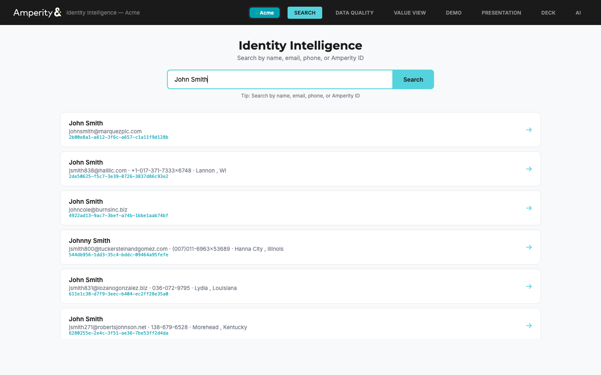
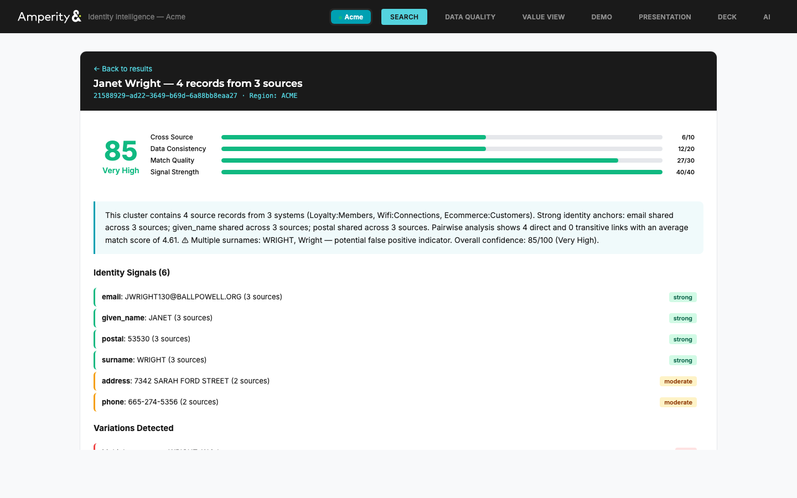
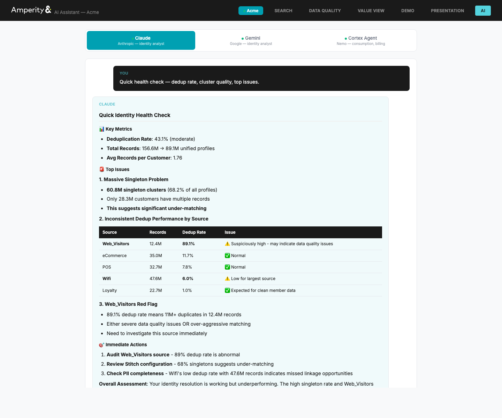
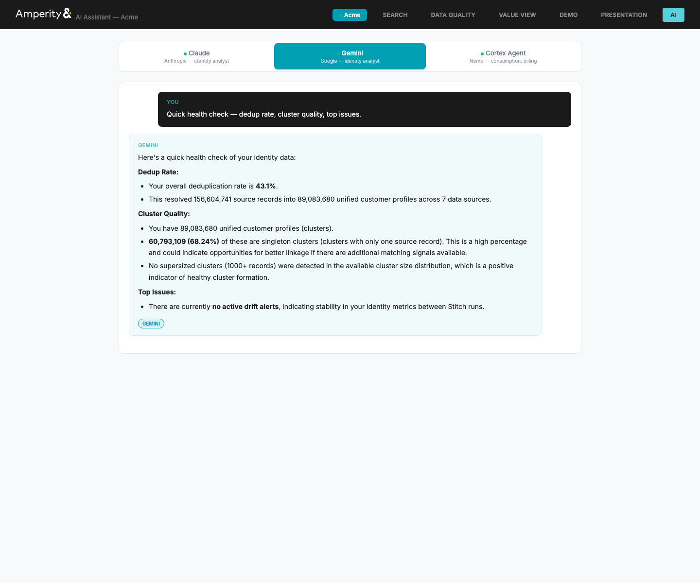
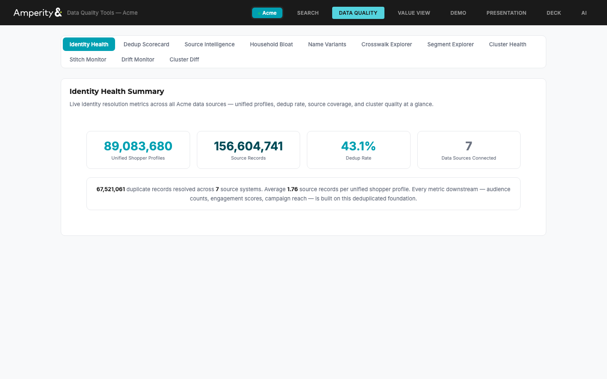
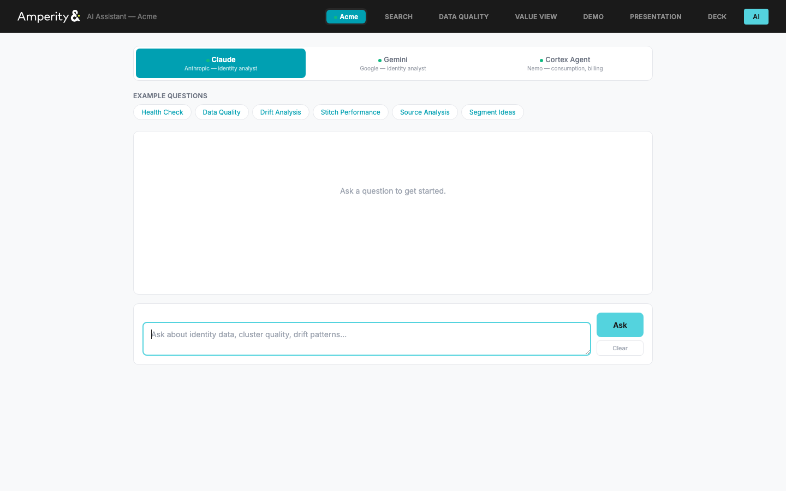
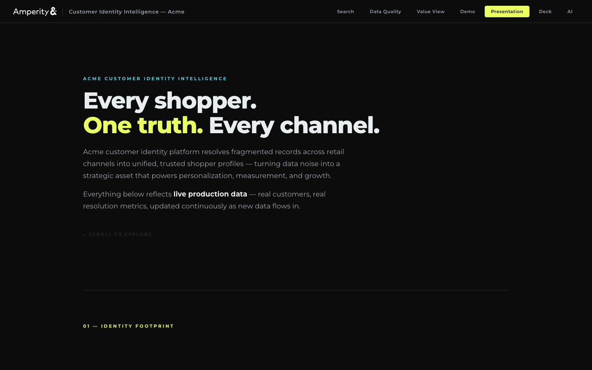
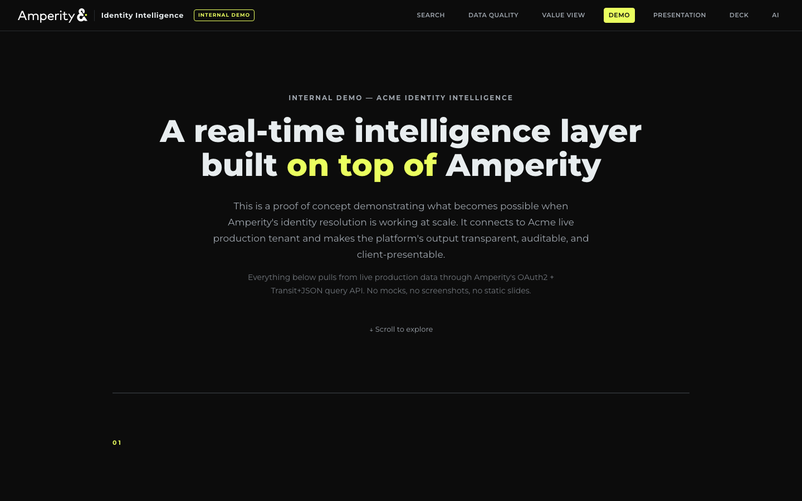

# Acme Identity Intelligence Layer (with Claude + Gemini)

Intelligence layer on top of Amperity's Stitch engine for the Acme demo tenant. Includes an AI assistant powered by Claude (Anthropic) and Gemini (Google) with live tool access to tenant data.

Built on existing Amperity APIs. Every data call maps 1:1 to an existing MCP tool or API endpoint.

## Screenshots

| Search Results | Cluster Explainability |
|:---:|:---:|
|  |  |

| Claude Response | Gemini Response |
|:---:|:---:|
|  |  |

| Data Quality | AI Assistant |
|:---:|:---:|
|  |  |

| Presentation | Demo |
|:---:|:---:|
|  |  |

## AI Assistant

The `/ai` view provides a conversational interface to the identity data with three modes:

**Claude (Anthropic)** and **Gemini (Google)** — identity resolution analysts with tool-use access to 11 internal API endpoints. They pull live tenant data before answering: identity health, dedup scorecard, source completeness, cluster distribution, drift alerts, stitch stats, customer search, cluster explainability, name variants, and source overlap.

**Cortex Agent (Nemo)** — Amperity's internal Snowflake Cortex agents for consumption data, billing, support metrics, and workflow health via MCP bridge.

### How it works

The AI assistant (`ai_engine.py`) uses Claude's or Gemini's function calling to query the app's own API endpoints in a loop — it decides what data it needs, pulls it, analyzes it, and responds grounded in real numbers. Multi-turn conversation with memory within a session.

Set `CLAUDE_API_KEY` and/or `GEMINI_API_KEY` in `.env` to enable. When both are set, you choose which provider to use from the UI.

## What It Does

**Identity Explainability** — "Why did these records merge?" answered with a confidence score (0-100), merge narrative, signal breakdown, source-by-source analysis, and pairwise score visualization.

**Continuous Quality Monitoring** — Cluster statistics, score distributions, and source field completeness compared against historical baselines. Detects drift between Stitch runs.

**Segment Discovery** — Identifies high-value segments from the identity data and generates SQL for the platform's query builder.

**COTM Value Framing** — Maps identity metrics to Command of the Message value drivers for client conversations.

## Quick Start

```bash
cp .env.example .env
# Add Amperity OAuth2 credentials + Claude/Gemini API keys
./launch.sh
```

Opens at `http://localhost:5080`

## Views

| Route | View |
|---|---|
| `/` | Identity Search — cluster explainability, confidence scoring, merge narrative |
| `/tools` | Data Quality — dedup scorecard, source coverage, stitch stats, drift monitoring |
| `/cotm` | Value View — COTM-framed metrics for client conversations |
| `/demo` | Internal Demo — live data, not for distribution |
| `/presentation` | Client Presentation — external-facing, business outcomes |
| `/ai` | AI Assistant — Claude, Gemini, or Cortex Agent |

## Configuration

```bash
# Amperity tenant
REGION_ACME_NAME=Acme
REGION_ACME_TENANT=acme
REGION_ACME_TENANT_ID=acme2          # X-Amperity-Tenant header
REGION_ACME_CLIENT_ID=               # OAuth2 client ID
REGION_ACME_CLIENT_SECRET=           # OAuth2 client secret
REGION_ACME_DATABASE_ID=             # C360 database ID
REGION_ACME_SEGMENT_ID=              # Draft SQL segment ID
REGION_ACME_DATASET_ID=              # From browser DevTools

# AI Assistant (set one or both)
CLAUDE_API_KEY=                      # Anthropic API key
GEMINI_API_KEY=                      # Google AI API key
```

## Architecture

```
├── app.py              # Flask server + API routes
├── ai_engine.py        # Claude/Gemini assistant with tool-use
├── amperity_api.py     # OAuth2 + Transit+JSON query client
├── explainability.py   # Confidence scoring + merge narrative
├── cortex_agent.py     # Nemo/Cortex Agent via MCP bridge
├── drift_store.py      # SQLite drift monitoring
├── static/             # View HTML files
└── screenshots/
```
