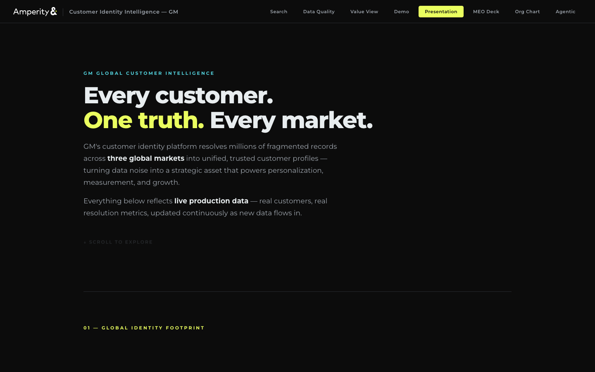
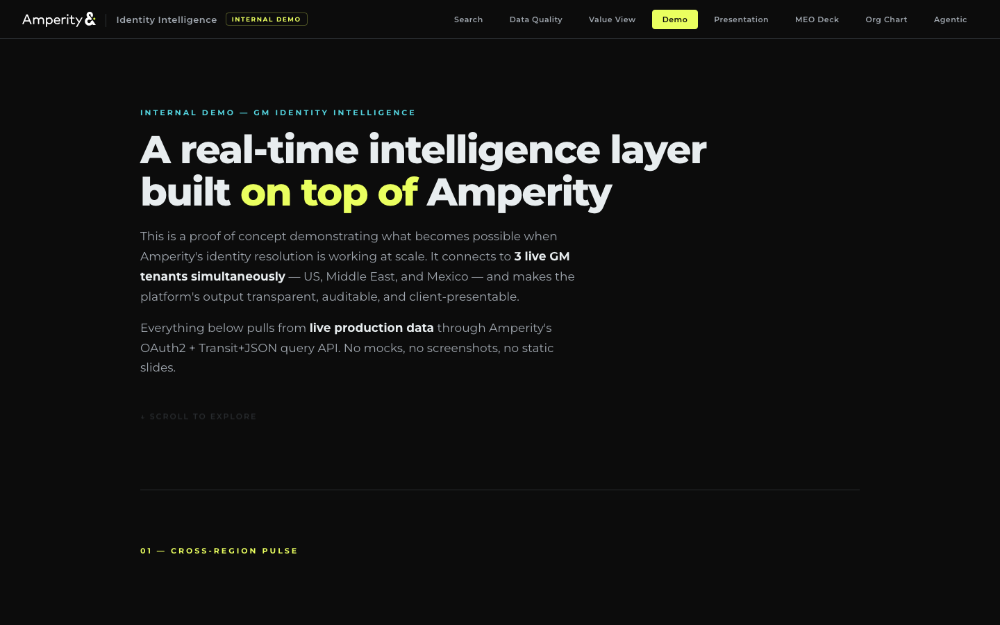
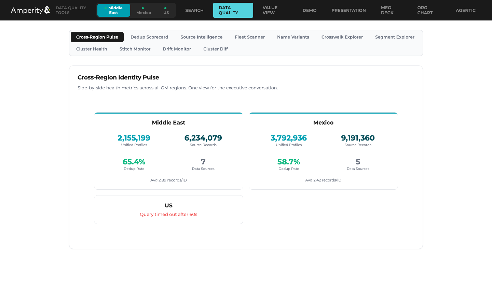
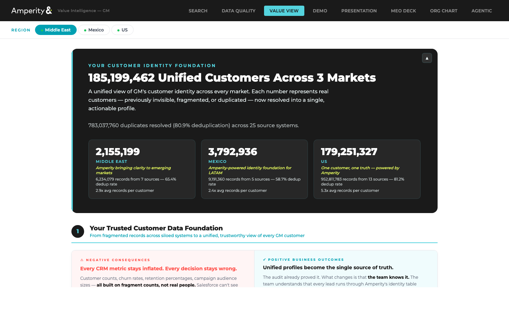
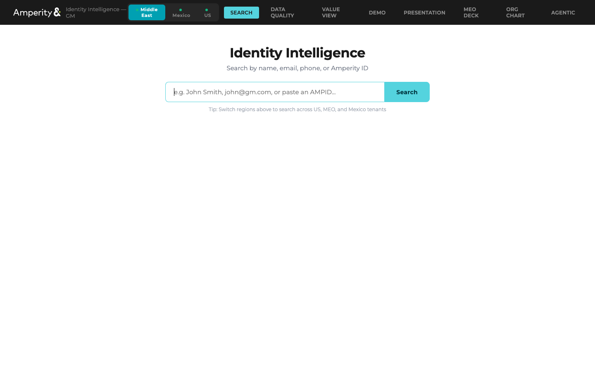

# GM Identity Intelligence Layer

An intelligence layer that sits on top of Amperity's identity resolution engine, querying three GM production tenants (US, MEO, Mexico) simultaneously. Stitch is the engine — this is the surface that makes the engine's power visible and actionable.

Built on existing Amperity APIs and the MCP server. Every data call maps 1:1 to an existing MCP tool or API endpoint. Nothing custom on the backend.

## Screenshots

| Presentation | Demo | Data Quality |
|:---:|:---:|:---:|
|  |  |  |

| COTM Value View | Identity Search |
|:---:|:---:|
|  |  |

## What It Does

**Identity Explainability** — Translates Stitch output into natural language. "Why did these records merge?" answered with a confidence score, merge narrative, signal breakdown, source-by-source analysis, and pairwise score visualization. Pulls from Unified Coalesced and Unified Scores in real time.

**Cross-Tenant Intelligence** — Queries all three GM tenants simultaneously and presents a unified view: cluster health compared across regions, identity quality benchmarked by market, survivorship consistency validation. This capability does not exist natively in the platform.

**Continuous Quality Monitoring** — After each Stitch run, queries cluster statistics, score distributions, and source field completeness. Compares against historical baselines. Detects cluster count drift, score distribution shift, oversized clusters, and source quality degradation.

**Segment Discovery** — Identifies high-value segments from the identity data itself (multi-source customers, cross-channel loyalists, high-confidence clusters) and generates SQL that copies directly into the platform's query builder.

**COTM Value Framing** — Maps identity metrics to Command of the Message value drivers, creating a direct line from data to business narrative backed by live tenant metrics.

## Quick Start

```bash
# Add OAuth2 credentials to .env (Settings > API Keys in each tenant)
# Everything else (database IDs, segment IDs) is pre-configured.
./launch.sh
```

Opens at `http://localhost:5080`

## Views

| Route | View |
|---|---|
| `/` | Identity Search — cluster explainability, confidence scoring, merge narrative |
| `/tools` | Data Quality — cross-region pulse, dedup scorecard, stitch stats, drift |
| `/cotm` | Value View — COTM-framed metrics for client conversations |
| `/demo` | Internal Demo — live data, not for distribution |
| `/presentation` | Client Presentation — external-facing, business outcomes |
| `/agentic` | Agentic Marketing — AI agent capabilities over unified identity data |

## Configuration

Each region needs credentials in `.env`:

```bash
REGION_{PREFIX}_CLIENT_ID=        # OAuth2 client ID
REGION_{PREFIX}_CLIENT_SECRET=    # OAuth2 client secret
```

Three regions pre-configured: `US` (gm), `MEO` (gmmeo), `MX` (gmmx). The app loads whichever `REGION_*` blocks it finds.

## Architecture

```
├── app.py              # Flask server + API routes
├── amperity_api.py     # Multi-region OAuth2 + Transit+JSON query client
├── explainability.py   # Confidence scoring + merge narrative
├── drift_store.py      # SQLite drift monitoring
├── static/             # View HTML files
└── screenshots/
```
